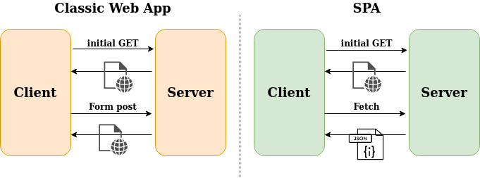

# Single Page Application
In this section, we will learn the concept of *Single Page Application* (SPA), how to make a SPA and how to dedicated client side framework.

A SPA is a web application accessed with a unique web page instead of loading entire new pages. It interacts with the user by dynamically rewritting some parts of the current web page by retrieving data from the server. All necessary HTML, CSS and JavaScript are retrieved with a single page load (or dynamically loaded and added to the pages thereafter). There should not be a reload of the page at any point of the use of the SPA, nor delegation of control process to another page.

SPA rely on dynamic communication with the server, either by using [AJAX/Fetch API](../JS/api.md) or websocket to modify elements on the page. Below a comparative illustration.

| Classic Web App | Single Page App |
| :------------- | :----------: |
| Made of several pages | Only one page |
| Web browsers generally just display pages and gives to the server the users' input | Web browsers fully exploited and dynamically retrieve content from the server |
| All the logic of the App is served-sided | Either the logic is client sided (beurk!) or separate as much as possible to not compromise security |
| Server reacts to user interaction and serves new page | The server is responsible to expose and make accessible app's resources (*e.g.* REST API)| 

SPA tends to favorise a better maintenance, and a better referencement. They also emphasize a stronger organisation of your application and offer increased performances, mostly when the server's tasks are heavy since a lot of logic is client sided.


One major drawback of SPA is they reliance to JavaScript. If your user has deactivated (or cannot correctly interpret) JavaScript on its browser, your site is unusable (or worst, can have some security flows). Keep that in mind, especially when you strongly couple SPA with web components, since the web components standard is not well implemented in all the browsers.


An important point is that SPA tends to rely heavily on the notion of web components (cf. dedicated [section](component.md)). Briefly, they are custom and reusable HTML elements embeding their own logic. 

## Vue.js
In this course, we will use Vue.js as our JavaScript framework for building SPA. There is a lot of other JavaScript frameworks out there, such as:
* [React](https://reactjs.org/)
* [Angular](https://angular.io/)
* [Polymer](https://www.polymer-project.org/)

Vue.js is a modern JavaScript framework that provides useful facilities for progressive enhancement and strong reactivity. It is one of the most easy to use framework and lightweight. It also adopts a "middle ground" approach, instead of more important framework like Angular, where *e.g.* route and state management are delegated to other (already) existing libraries doing the work quite well. And unlike many other frameworks, you can use Vue.js to enhance existing HTML. 

Usually, a JavaScript framework allows you to handle the DOM of your page more easily by giving you new ways to manage it, create reactivity (*i.e.* using a built-in observator pattern for your object's properties) between various HTMLxJavaScript elements and providing you with usefull new API.

### Installation and demo
The installation procedure of Vue.js is explained in the [official doc](https://vuejs.org/v2/guide/installation.html#CLI). Here, we are interested in the CLI installation (there is a more detailed explanation in the [setup of your project](../TP/setup.md) section.), which gives us a way to quicly create a new projet and scaffold important project. 


Using the important method is good for small project and tests. But it will quickly become not practicable! Use the **CLI**!


Instead of rewritting the procedure, it's demo time for creating a new project! 

🕑***Time passes***🕑

Your `src/` folder contains all the Vue app and components you create. `src/App.vue` is your main vue (top-level) component, which globally load the framework. The folder `src/components/` should contains all your web components. `src/assets/` is used to store static assets like CSS and images. `src/routers` contains your route configuration for a SPA, and `src/views/` contains all the vue (the "pages" or sections) of your SPA.

[Vue.js official documentation is accessible here.](https://vuejs.org/v2/guide/installation.html).

### Some cool stuffs
Install the plugin `Vetur` for VS Code for code highlights!

Currated list of various components and stuff for Vue.js: [Awesome Vue](https://github.com/vuejs/awesome-vue#pdf)